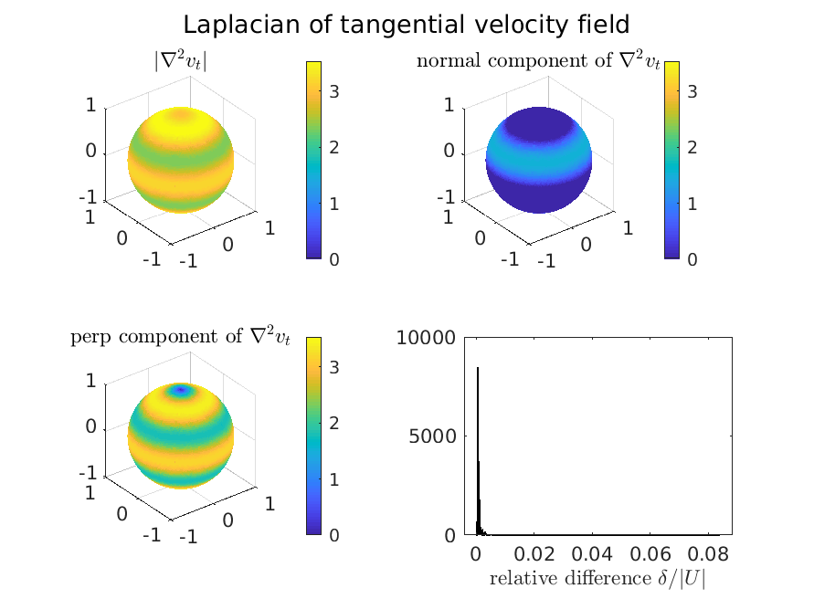

<<<<<<< Local Changes
DEC
===
=======
DiscreteExteriorCalculus
========================
>>>>>>> External Changes

<<<<<<< Local Changes
DEC is a Discrete Exterior Calculus toolbox for MATLAB. 
=======
The DiscreteExteriorCalculus (DEC) package is a self-contained MATLAB toolkit for analysis of motion of velocities/flows on curved surfaces, applicable to shape-changing shapes.
>>>>>>> External Changes

.. toctree::
   :maxdepth: 4

Example Usage
-------------

<<<<<<< Local Changes
Suppose we have a triangulated mesh called ``mesh`` with f

.. code-block:: matlab

	dec = DiscreteExteriorCalculus(mesh.v, mesh.f)

	
=======
Example script for a disk-like mesh:

.. toctree::
   :maxdepth: 1

   example_DEC_diskMesh

.. image:: images/DEC_diskMesh_output.jpg
  :width: 891  
  
Example script for a sphere-like mesh:

.. toctree::
   :maxdepth: 1

   example_DEC_sphericalMesh

   
   	
>>>>>>> External Changes
Full Contents:
--------------

.. automodule:: DEC/@DiscreteExteriorCalculus
    :show-inheritance:
    :members:

	
Indices and tables
------------------

* :ref:`genindex`
* :ref:`modindex`
* :ref:`search`
