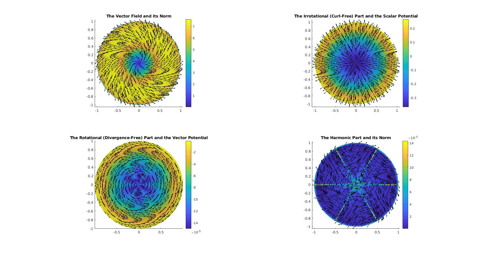

.. TubULAR documentation master file, created by
   sphinx-quickstart on Tue Feb 22 17:54:20 2022.
   You can adapt this file completely to your liking, but it should at least
   contain the root `toctree` directive.

Welcome to TubULAR's documentation!
===================================

What is it?
-----------
TubULAR is a set of tools for working with 3D data of surfaces -- potentially complex and dynamic -- that can be described as tubes.
Developing guts, neural tubes, and pumping hearts can all be treated as tubes, with potentially complex and dynamic shapes.
With TubULAR, we can describe the tissue motion on the tube-like surface and quantify how it changes over time.

.. image:: images/MegaComposite_withMSGrowEvolve_vtG_vn_085_annotated.png
   :width: 1200

Usage
-----

TubULAR is self-contained MATLAB code, so no additional dependencies are strictly necessary. 
However, there is additional functionality included in the tutorials that use ImSAnE environments and Morphological Snakes level set surface detection methods. 

Let's get going
---------------
Download TubULAR in Mac or Linux, navigate in Terminal to a path where you'd like to place the code, then clone the repository::

	cd ~
	git clone ssh://www.github.com/npmitchell/tubular
	
There is now a directory called tubular. Open up MATLAB and take a look at some example scripts to get familiar.
    
Updates to the code are installed running the following command from the ``tubular`` directory::

    git pull

Components
----------
A typical **Tubular** pipeline uses several self-contained packages that we have included within TubULAR. We wrote two of these packages: **DEC**  for flow field analysis on curved surfaces, and **TexturePatch** for surface visualization.

**DEC** computes fully covariant Discrete Exterior Calculus measures of flow.

  
**TexturePatch** visualizes volumetric data on meshes in 3D and handles texture mapping data from one space/surface to another.

Optional dependencies for extra functionality
---------------------------------------------
**ImSAnE**

ImSAnE is a tissue cartography package developed by Idse Heemskirk and Sebastian Streichan [1]. To use ImSAnE with tubular or to use tubular inside ImSAnE, get the latest version of ImSAnE::

	cd ~
	git clone ssh://www.github.com/npmitchell/imsane
	
Then, before running an example script that uses ImSAnE, you'll need to navigate to the ImSAnE repository in MATLAB and run ``setup.m`` from there.
	
**Morphsnakes**

Morphsnakes was developed by Pablo Marquez-Neila, Luis Baumela and Luis Alvarez. The original version was posted to github here: <https://github.com/pmneila/morphsnakes>, but to use this with TubULAR and ImSAnE, we use a lightly modified version::

   sudo pip3 install PyMCubes	

   git clone https://github.com/npmitchell/morphsnakes.git

   cd morphsnakes
	
   python3 setup.py develop
	
   git clone https://github.com/npmitchell/morphsnakes_wrapper.git
	
   sudo pip3 install h5py
	
   sudo pip3 install seaborn
	
   sudo pip3 install matplotlib
	
   cd morphsnakes_wrapper

Edit run_morphsnakes.sh to your liking (setting paths to your data, parameters, etc). Then run it on your data as below. Documentation for parameters is in the bash script (run_morphsnakes.sh).::

	bash run_morphsnakes.sh
	
  
Example usage with optional dependencies
----------------------------------------
**ImSAnE**

To run ImSaNE using TubULAR's functionality for surface detection and fitting, follow this template.

.. toctree::
  :maxdepth: 2
  :caption: Auxiliary contents used by principal contents:

  example_usage_imsane_with_tubular

Conversely, to follow a TubULAR pipeline using an ImSaNE Experiment class instance, follow this template.

.. toctree::
  :maxdepth: 2
  :caption: Auxiliary contents used by principal contents:

  example_usage_tubular_with_imsane
  

**ImSAnE + Morphsnakes**
To run ImSaNE using Morphsnakes for the detector and TubULAR for the fitter, follow this template. Note that at the moment this requires interfacing MATLAB with python, as Morphsnakes is written in python. Future work will implement morphsnakes in MATLAB.

.. toctree::
  :maxdepth: 2
  :caption: Auxiliary contents used by principal contents:

  example_usage_imsane_morphsnakes_tubular
  
  
   

Overview of contents
--------------------

.. toctree::
   :maxdepth: 2
   :caption: Principal contents:

   TubULAR
   DEC
   TexturePatch
   RicciFlow_MATLAB
   

.. toctree::
  :maxdepth: 2
  :caption: Auxiliary contents used by principal contents:

  utility
   
  

Indices and tables
==================

* :ref:`genindex`
* :ref:`modindex`
* :ref:`search`
