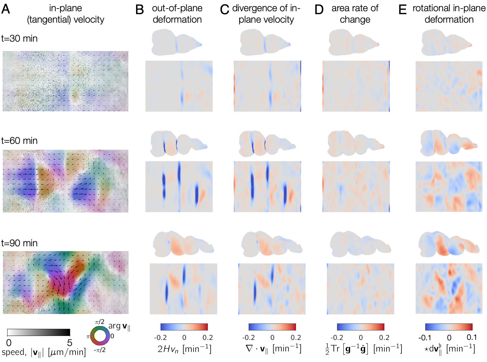
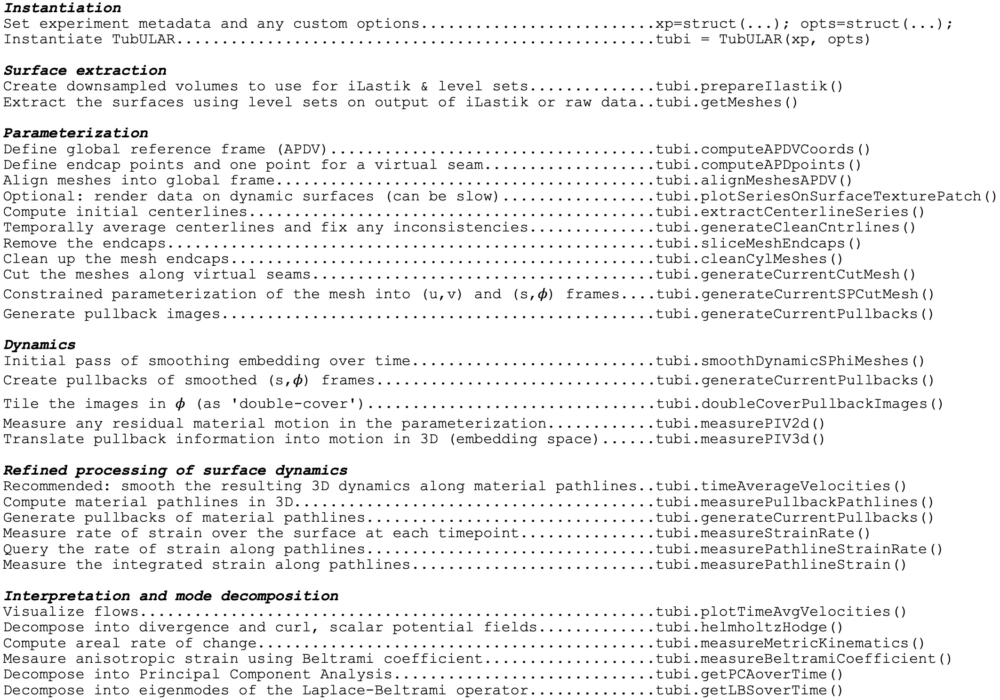
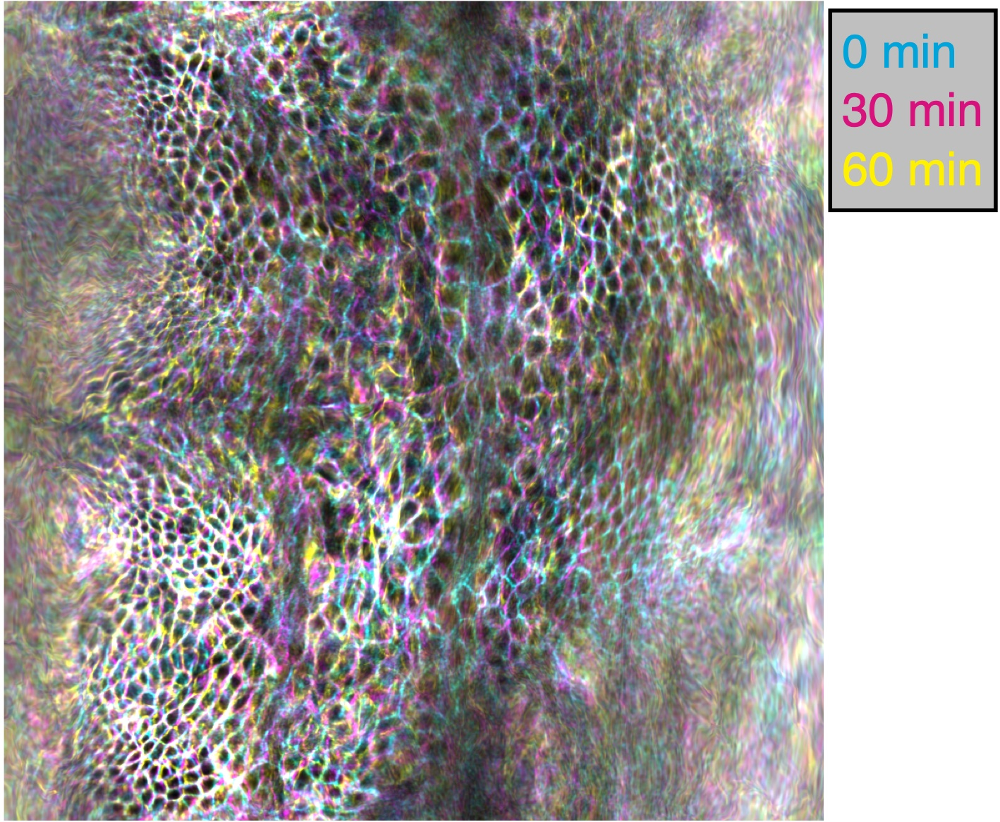

.. TubULAR documentation master file, created by
   sphinx-quickstart on Tue Feb 22 17:54:20 2022.
   You can adapt this file completely to your liking, but it should at least
   contain the root `toctree` directive.

Welcome to TubULAR's documentation!
===================================

What is it?
-----------
TubULAR is a set of tools for working with 3D data of surfaces -- potentially complex and dynamic -- that can be described as tubes.
Developing guts, neural tubes, and pumping hearts can all be treated as tubes, with potentially complex and dynamic shapes.
With TubULAR, we can describe the tissue motion on the tube-like surface and quantify how it changes over time.

.. image:: images/fig_tubular_overview_v3.jpg
   :width: 1200
   

Usage
-----

TubULAR is self-contained MATLAB code, so no additional dependencies are strictly necessary. 
However, there is additional functionality included in the tutorials that use ImSAnE environments and Morphological Snakes level set surface detection methods. 

Let's get going
---------------
Download TubULAR in Mac or Linux, navigate in Terminal to a path where you'd like to place the code, then clone the repository::

	cd ~
	git clone ssh://www.github.com/npmitchell/tubular
	
There is now a directory called tubular. Open up MATLAB and take a look at some example scripts to get familiar.
    
Updates to the code are installed running the following command from the ``tubular`` directory::

    git pull

So now your tubular is definitely up-to-date. 

We have tried our best to keep dependencies to an absolute minimum. One package that TubULAR will try to use if your surfaces are so "prickly" that they would cause potential issues is gptoolbox. This is a *MATLAB* package, but it has some mex files, which are *MATLAB*'s way of interfacing with custom *C++* code. If that sounds complicated, don't worry -- all you need to do is additionally download a copy of gptoolbox and compile it by typing a few lines in a *Terminal* window. If you like, you can also skip this step, go straight to the examples and deal with any potential issues by tweaking TubULAR's surface extraction parameters.

First download **gptoolbox** inside ``tubular/external/``.
	
	cd tubular/external/
	
	git clone https://github.com/alecjacobson/gptoolbox.git
	
Now that you've downloaded gptoolbox, go into the mex folder and compile 

	cd gptoolbox
	
	cd mex
    
	mkdir build
    
	cd build
    
	cmake ..
    
	make 

If you find trouble here, it is possible that you may have to tweak the CMake file depending on your computer specs. StackExchange is a place to look for any errors you might get.  
Now that you've downloaded TubULAR and built gptoolbox, let's look over the components of **TubULAR** and walk through an example.

TubULAR also uses CGAL, described in detail at https://www.cgal.org/. Installation instructions are at https://www.cgal.org/download.html. 

  
Prerequisites
-------------
This toolkit is written for MATLAB 2018 and above. The toolkit uses some external code included in the ``tubular/external/`` directory, but also you will need to compile gptoolbox for some functionality (see above). 

Components
----------
A typical **Tubular** pipeline uses several self-contained packages that we have included within TubULAR. We wrote two of these packages: **DEC**  for flow field analysis on curved surfaces, and **TexturePatch** for surface visualization.

**DEC** computes fully covariant Discrete Exterior Calculus measures of flow.

  
**TexturePatch** visualizes volumetric data on meshes in 3D and handles texture mapping data from one space/surface to another, such as the example gut images shown below:

.. image:: images/gut_figSI_morphsnakes_caax_sequence_v3.jpg
  :width: 891  
  

  
Let's walk through an example or two
------------------------------------
The basic workflow of a pipeline is shown below:

  
Here are some full examples, starting with one of the midgut.
.. toctree::
  :maxdepth: 1

  example_usage_tubular_gutSample
  
Among the neat things output from this pipeline is a series of pullback images in which the cells of the tissue barely move. Check out this overlay of three timepoints 30 minutes apart in cyan, magenta, and yellow pulled back into the material frame of reference below. Notice how the cells lay on top of each other (white colors).

  
  
Here is another example with a synthetic dataset. Note that the file paths have to be changed at the top of the script to the place where you download the data.
.. toctree::
  :maxdepth: 1

  example_usage_tubular

.. toctree::
  :maxdepth: 1

  example_usage_tubular_for_surface_visualization
  
Here is a very detailed example using the zebrafish heart data that highlights an alternative method for surface extraction.

.. toctree::
  :maxdepth: 1

  example_usage_zebrafish_heart
  
  
FAQ / Common Debugging Issues
-----------------------------

.. toctree::
  :maxdepth: 1

  faq_debugging

  
Optional packages for extra functionality
-----------------------------------------
**ImSAnE**

ImSAnE is a tissue cartography package developed by Idse Heemskirk and Sebastian Streichan [1]. Users already familiar with the ImSAnE workflow can access all the power of TubULAR within ImSAnE. If you've never heard of this before, you can take a look at `this paper <https://www.nature.com/articles/nmeth.3648>`_ for more details, or you can just skip this section without worry. To use ImSAnE with tubular or to use tubular inside ImSAnE, get the latest version of ImSAnE::

	cd ~
	git clone ssh://www.github.com/npmitchell/imsane
	
Then, before running an example script that uses ImSAnE, you'll need to navigate to the ImSAnE repository in MATLAB and run ``setup.m`` from there.
	
**Morphsnakes**

Maybe you want some extra knobs to fine-tune your surfaces, beyond the built-in **MATLAB** ``activecontour`` implemented in the **TubULAR** pipeline. Morphsnakes was developed by Pablo Marquez-Neila, Luis Baumela and Luis Alvarez. The original version was posted to github here: <https://github.com/pmneila/morphsnakes>, but to use this with TubULAR and ImSAnE, we use a lightly modified version::

   sudo pip3 install PyMCubes	

   git clone https://github.com/npmitchell/morphsnakes.git

   cd morphsnakes
	
   python3 setup.py develop
	
   git clone https://github.com/npmitchell/morphsnakes_wrapper.git
	
   sudo pip3 install h5py
	
   sudo pip3 install seaborn
	
   sudo pip3 install matplotlib
	
   cd morphsnakes_wrapper

Edit run_morphsnakes.sh to your liking (setting paths to your data, parameters, etc). Then run it on your data as below. Documentation for parameters is in the bash script (run_morphsnakes.sh).::

	bash run_morphsnakes.sh
   
.. raw:: html

..   <iframe width="560" height="315" src="http://www.youtube.com/embed/ID?rel=0" frameborder="0" allowfullscreen></iframe>

  
Example usage with optional dependencies
----------------------------------------
**Using TubULAR within ImSAnE**

To run ImSaNE using TubULAR's functionality for surface detection and fitting, follow this template.

.. toctree::
  :maxdepth: 1

  example_usage_imsane_with_tubular

Conversely, to follow a TubULAR pipeline using an ImSaNE Experiment class instance, follow this template.

.. toctree::
  :maxdepth: 1

  example_usage_tubular_with_imsane
  
  
   

Overview of contents
--------------------

.. toctree::
   :maxdepth: 2
   :caption: Principal contents:

   TubULAR
   DEC
   TexturePatch
   RicciFlow_MATLAB
   

.. toctree::
  :maxdepth: 2
  :caption: Auxiliary contents used by principal contents:

  utility
   
  

Indices and tables
==================

* :ref:`genindex`
* :ref:`modindex`
* :ref:`search`
