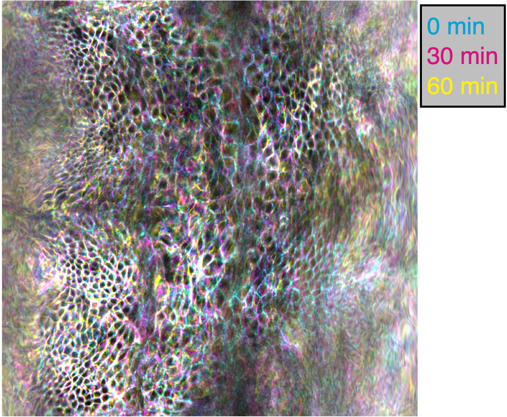
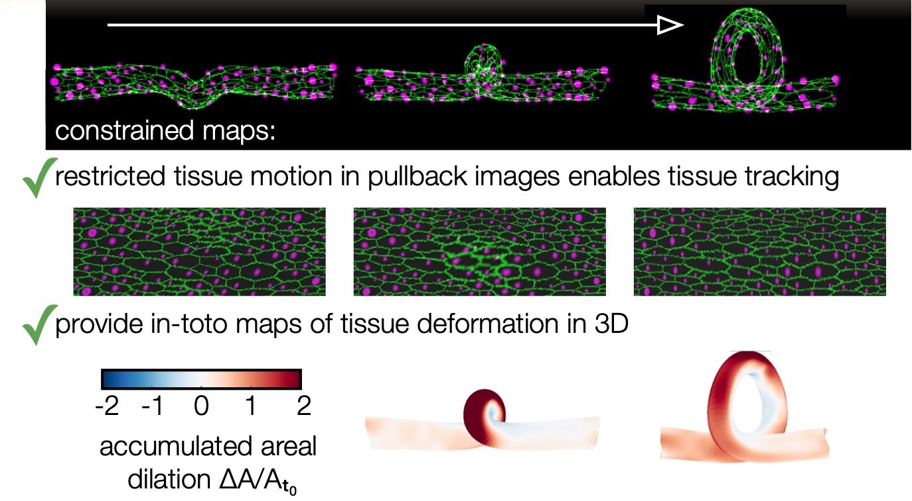

.. TubULAR documentation master file, created by
   sphinx-quickstart on Tue Feb 22 17:54:20 2022.
   You can adapt this file completely to your liking, but it should at least
   contain the root `toctree` directive.

Welcome to TubULAR's documentation!
===================================


What is it?
-----------
TubULAR is a set of tools for working with 3D data of surfaces -- potentially complex and dynamic -- that can be described as tubes.
Developing guts, neural tubes, and pumping hearts can all be treated as deforming tube-like surfaces. Mapping these surfaces to a fixed frame of reference allows us to follow the cells (or other objects) as they move in 3D with ease.
With TubULAR, we can capture the tissue motion and quantify how it changes over time.

.. image:: images/fig_tubular_overview_v3.jpg
   :width: 1200
   
You can check out the preprint here: https://www.biorxiv.org/content/10.1101/2022.04.19.488840

Data for tutorials are available here: https://doi.org/10.6084/m9.figshare.c.6178351

The GitHub repository is here: https://github.com/npmitchell/tubular

Usage
-----

TubULAR is written in MATLAB. There are example scripts in the Tubular repository, in ``tubular/example/`` (see the GitHub page here: https://github.com/npmitchell/tubular). The basic workflow of a typical pipeline is shown below:

.. image:: images/figSI_tubular_examplePipeline.jpg
	:width: 891  
  


Installation (Let's get going!)
-------------------------------
We have tested TubULAR in Linux, Mac OS 11, and Windows 10 operating systems. Here, we will walk through the installation, but if anything goes awry, check the FAQ page here:

.. toctree::
  :maxdepth: 1

  faq_debugging
  

To get going, install MATLAB from www.mathworks.com if you don't already have an installation. To download TubULAR in Linux or Mac, just navigate in Terminal to a path where you'd like to place the code, then clone the repository::


	cd ~/path/to/the/repository
	git clone --recursive http://www.github.com/npmitchell/tubular
	
There is now a directory called tubular. Open up MATLAB and take a look at some example scripts.
    
Updates to the code are installed by running the following command from the ``tubular`` directory::


    git pull

So now your tubular is definitely up-to-date. 

Just FYI, there are two linked repositories that are not pulled with this line: upon cloning TubULAR on your local machine, DECLab and TexturePatch, which are linked repositories within TubULAR, were pulled only because we used the ``--recursive`` option before. These two repositories are available here: https://github.com/DillonCislo/DEC and https://github.com/npmitchell/TexturePatch. Note that the example scripts expect these repositories to be populated in the folders called DECLab and TexturePatch, so be sure to clone with the ``--recursive'' option and make sure their contents sit in those directories. To update them, run::


	cd TexturePatch
	git pull
	cd ../DECLab
	git pull

We have tried to keep dependencies to a minimum. One package that TubULAR will try to use if your surfaces are so "prickly" that they would cause potential issues is gptoolbox. This is a *MATLAB* package, but it has some mex files, which are *MATLAB*'s way of interfacing with custom *C++* code. If that sounds complicated, don't worry -- all you need to do is additionally download a copy of gptoolbox and compile it by typing a few lines in a *Terminal* window. You can also skip this step, go straight to the examples section further down on this page and deal with any potential issues by tweaking TubULAR's surface extraction parameters.

Now that you've cloned TubULAR, **gptoolbox** is found inside this TubULAR repository, and we need to compile one function in there. Let's navigate there::
	 

	cd tubular/external/gptoolbox/external/toolbox_fast_marching/	
	compile_mex
	
In other words, open MATLAB, then open the script in ``tubular/external/gptoolbox/external/toolbox_fast_marching/compile_mex.m``. Change the current working directory to the parent directory of this file (which is ```tubular/external/gptoolbox/external/toolbox_fast_marching/''), then run the file. In our hands, this works on Linux and Mac operating systems. For Windows machines, you will need a supported compiler -- see https://www.mathworks.com/support/requirements/supported-compilers.html. If these functions compile, then we're good to go with **gptoolbox**. If this compilation fails, you might get an error when running a TubULAR script like ``Undefined function 'perform_front_propagation_3d' for input arguments of type 'double'.``
	
Making pullback projections will require the Optimization Toolbox, and we also use Curve Fitting Toolbox (for ``smooth``), Statistics and Machine Learning Toolbox (or you can just rip the function ``prctile`` for this one), and the Image Processing Toolbox. You can install these in MATLAB by clicking in the Home tab of the toolbar: ``Add-Ons > Get Add-Ons`` and searching for the Toolbox name. If you don't have access to these toolboxes, you can get functions that do the trick 'a la carte'.

TubULAR uses "under-the-hood" PIVLab commands for refinement of the stabilized coordinates after the smoothed (s,phi) coordinates are defined. To install PIVLab, click the APPS tab in MATLAB (next to PLOTS and EDITOR tabs), click 'Get More Apps', search for PIVLab, and click Install.

Now that you've downloaded TubULAR and gathered the dependencies, let's look over the components of **TubULAR** and walk through an example.

  
Prerequisites
-------------
This toolkit is written for MATLAB 2018 and above in Linux or Mac operating systems. The toolkit uses some external code included in the ``tubular/external/`` directory, but also you will need to compile gptoolbox for some functionality (see above). 


Components
----------
A typical **Tubular** pipeline uses several self-contained packages that we have included within TubULAR. We wrote two of these packages: **DEC**  for flow field analysis on curved surfaces, and **TexturePatch** for surface visualization.

**DEC** computes fully covariant Discrete Exterior Calculus measures of flow.

.. image:: images/fig_tubular_tissueFlow_v2.jpg
  :width: 891  
  
**TexturePatch** visualizes volumetric data on meshes in 3D and handles texture mapping data from one space/surface to another, such as the example gut images shown below:

.. image:: images/gut_figSI_morphsnakes_caax_sequence_v3.jpg
  :width: 891  
  

Overview of a TubULAR script
----------------------------
1. The TubULAR workflow assumes individual TIFF files for each timepoint matching a common naming convention. For example, Timepoint_000000.tif, Timepoint_000001.tif, etc would be found in the same directory. If the dataset has multiple channels, all channels to be used should be found within the same file for a given timepoint, and the metadata instructs TubULAR how to interpret the axis order. 


We first will define metadata in three forms: there is ``expMeta`` for experiment metadata, ``fileMeta`` for information on the filenames and formats, and ``opts`` for options for how TubULAR will handle the data. For example, the resolution (in microns per pixel, for ex) is in ``expMeta``, ``channelsUsed`` specifies which channels (ex, GFP) are used in ``fileMeta``, and ``phiMethod`` selecting how to stabilize motion along the circumferential axis is stored in ``opts``. For organizational homology with ImSAnE, we also define ``detectOptions`` specifying how to detect the surface, and we place this struct inside a struct ``xp`` along with ``expMeta`` and ``fileMeta``. We then define an instance of the TubULAR class by passing ``xp`` and ``opts``. Creating the TubULAR instance will define some folders to store the output in ``opts.meshDir``. 

We note that the user can choose to create ``xp`` as an instance of ImSAnE's Experiment class instead of as a simple struct. In that case, ```xp``` contains fileMeta, expMeta, and detectOptions information already.


An output directory for the data will be generated upon instantiation of the TubULAR class::


    xp = struct('fileMeta', fileMeta, 'expMeta', expMeta, 'detectOptions', detectOptions) ;
	opts = struct('meshDir', '/path/to/output/' ;        % Directory where meshes reside
	    'timeInterval', 1 ; % Spacing between adjacent timepoints in units of timeUnits
	    'timeUnits', 'min', ...  % units of time, so that adjacent timepoints are timeUnits * timeInterval apart
	    'spaceUnits', 'um', ...  % Units of space in LaTeX, for ex '$mu$m' for micron
	    'nU', 100, ...           % How many points along the longitudinal axis to sample surface
	    'nV', 100, ...                % How many points along the circumferential axis to sample surface
	    'normalShift', 10, ...       % Additional dilation acting on surface for texture mapping, in pixels
	    'a_fixed', 1.0, ...          % Fixed aspect ratio of pullback images. Setting to 1.0 is most conformal mapping option.
	    'phiMethod', 'curves3d', ... % Method for following surface in surface-Lagrangian mapping [(s,phi) coordinates] ('curves3d' or 'texture' or 'combined')
	    'lambda_mesh', 0.00, ...     % Smoothing applied to the mesh before DEC measurements
	    'lambda', 0.0, ...           % Smoothing applied to computed values on the surface
	    'zwidth', 2 ;			% How many longitudinal steps to average over in smoothing during deformation analysis 
	    'nmodes', 7);				% How many lowest-order Fourier modes to keep in smoothing during deformation analysis 
	tubi.TubULAR(xp, opts) ;


The directory structure information for inputs and outputs of the class are stored in the ``dir`` property of the TubULAR class instance. While multiple surfaces per timepoint can be analyzed by separate class instances of TubULAR, the default workflow is designed for a single surface per timepoint. For example, if the user would like to analyze the relative motion between two concentric tissue layers, the user could obtain a surface that lies approximately in between the two layers. In this scheme, the output of one TubULAR class instance rendering tissue texture at some positive distance from the mesh surfaces could be compared against the output of another TubULAR class instance rendering tissue texture at some negative distance from the mesh surfaces. In such a scenario, the two instances could share the same mesh directory (and other properties) to ensure no differences in measured motion arose from differences in the constrained mapping procedure.


2. The next step is to define the surface meshes (if they don't already exist in the output meshDir). By default, we do this by creating downsampled h5 files of the data, loading them into iLastik, training on the boundary surface that you want to capture, and then using a 3D active contour. To create the downsampled h5 files, run::


	tubi.prepareIlastik() ;

This generates h5 files for each timepoint, with a subsampling factor given by ssfactor in the metadata. Now, open up iLastik, create a Pixel Classification project file. See the iLastik website for a full demo: https://www.ilastik.org/. Load in some subset of your timepoints one-by-one. Depending on your metadata, the h5s may need to have their axis orders modified to be loaded in correctly. For instance, if you have a 2-color dataset and you see your data loaded in with one of the spatial dimensions (X, Y, or Z) being only two voxels thick, then you can right click on the file in the Input Data tab, click Edit Properties, and modify the 'Interpret axes as' field. Select all the features in the Feature Selection tab. Move to the Training tab and classify voxels as different Labels (colors). For example, identify tissue as Label 1 and voxels inside the tissue as Label 2. Use as few marks as you can while obtaining good results. Use the Live Update button to preview the classification, and toggle on/off different Labels in the Group Visibility window. If the training is running to slowly on your computer, select all the features at first, then use the "Suggest Features" option in the Training tab to reduce the computational load. Once you have a reasonable result for your sample timepoints, batch process all timepoints with your training. The next step in MATLAB will look for h5 files output from iLastik with the default naming, or you can customize the names and note this in the options struct passed to getMeshes():


	tubi.getMeshes() ;
	
This step loads in your prediction and runs a 3D active contour level sets approach to segment the surface of the organ tissue. Note that there are many options for how these meshes are extracted. See the documentation of getMeshes() for details. For instance, instead of the level sets approach, we could simply segment the training output via thresholding and compute from the volumetric segmentation via marching cubes. Later steps will keep only the largest connected component of the mesh triangulation, so small unconnected mesh surfaces far from the tissue will not impact the result. 

For the level sets option (the default), the segmentation output of one timepoint will be used as the input 'guess' for the subsequent timepoint, and the level set will evolve to match the current timepoint given that initial guess. The ``detectOptions`` metadata are used to determine the parameters and details of the procedure.
	
3. We now turn to parameterizing the surface. For the first step here, we define the coordinate frame in which we analyze the data, which we call APDV after 'anterior-posterior-dorsal-ventral'. In practice, this could just be the XYZ coordinate system of the data, or something else like a proximal-distal axis. Note that this is just to define the viewing frame and not yet to define anything about the true anterior and posterior end of the sample (or proximal and distal end, etc). This step can either use the data frame, the elongation axis of the surface mesh at the reference timepoint, or the output of iLastik training. If you choose to use iLastik, you would train on a blob near one 'anterior' end, a blob near another 'posterior' end, background, and a blob near the 'dorsal' side to define a coordinate system.


	tubi.computeAPDVCoords() ;
	
We then select the endcaps for the centerline computation (A and P) and a point along which we will form a branch cut for mapping to the plane (D). We call this D because we envision choosing the dorsal direction as the cut. Similarly to before, you can select these points by hand (point-and-click in a figure) or using iLastik to train on the particular endcaps and another blob elsewhere on the surface (in the dorsal direction). See example scripts for details.


	tubi.computeAPDpoints(apdvOpts); 

At this point, you may choose to render the data on the surfaces that you've extracted:


	tubi.plotSeriesOnSurfaceTexturePatch() ;

For meshes with many faces, this may be slow. This step is optional and does not impact future calculations.

We then define centerlines, which are 1D curves in 3D that pass from the anterior point to the posterior point through the center of the volume enclosed by each mesh. These connect the anterior points (A) to the posterior points (P) by passing through the middle of the volume. Computationally, this is accomplished via fast-marching from one endpoint to the other through the distance transform of the data volume. The curve preferentially passes through voxels far from the mesh surface, as these are given higher weight by the distance transform. Physically, this is like finding the fastest path through the volume when the speed of passing through a given voxel is determined by the distance transform. 


	tubi.generateFastMarchingCenterlines() ;

We also 'clean' the centerlines in case there are spurious results in isolated timepoints. If your sample is moving around a lot, you can choose a very large distance threshold to ignore the cleaning step. 

	
	tubi.cleanFastMarchingCenterlines() ;


Now we cut off a little endcap on each end around the 'anterior' and 'posterior' endpoints.


	tubi.sliceMeshEndcaps();

Triangles of the mesh triangulation near the endpoints need to have vertices with more than two edges for technical reasons. So we remove "ears" on the endcaps of the cylindrical meshes:


	tubi.cleanCylMeshes();

Finally, we can create pullbacks to the plane for each timepoint::


	for tt = tubi.xp.fileMeta.timePoints    
	    tubi.setTime(tt) ;
    
	    % Create the Cut Mesh
	    tubi.generateCurrentCutMesh(options)
	    
		% Plot the cutPath (cutP) in 3D
	    tubi.plotCutPath(tubi.currentMesh.cutMesh, tubi.currentMesh.cutPath)
	    
		tubi.getCurrentUVCutMesh() ;
    
	    spcutMeshOptions = struct() ;
	    spcutMeshOptions.t0_for_phi0 = tubi.t0set() ;  % which timepoint do we define corners of pullback map
	    spcutMeshOptions.save_phi0patch = false ;
	    spcutMeshOptions.iterative_phi0 = false ;
	    spcutMeshOptions.smoothingMethod = 'none' ;
	    tubi.generateCurrentSPCutMesh([], spcutMeshOptions) ;
    
	    pbOptions = struct() ;
	    pbOptions.numLayers = [0 1] ; % how many onion layers over which to take MIP
	    tubi.generateCurrentPullbacks([], [], [], pbOptions) ;
	end

Now that we have a partially stabilized parameterization, we can smooth the (s,phi) grid meshes in time, if desired. A width of 0 will result in no smoothing. We find this smoothing step helps with the subsequent PIV stabilization::


	options = struct() ;
	options.width = 4 ;  % width of kernel, in #timepoints, to use in smoothing meshes
	tubi.smoothDynamicSPhiMeshes(options)

	% Redo Pullbacks with time-smoothed meshes 
	for tt = tubi.xp.fileMeta.timePoints
	    tidx = tubi.xp.tIdx(tt);
    
	    % Load the data for the current time point ------------------------
	    tubi.setTime(tt) ;
    
	    % Establish custom Options for MIP --> choose which pullbacks to use
	    pbOptions = struct() ;
	    pbOptions.numLayers = [0 5] ; % how many onion layers over which to take MIP
	    pbOptions.generate_spsm = true ;
	    pbOptions.generate_sp = false ;
	    pbOptions.overwrite = false ;
	    tubi.generateCurrentPullbacks([], [], [], pbOptions) ;
	end

4. We are in a position to measure 3D flow fields and then to stabilize any residual motion in the pullback plane, using PIV to modify the parameterization of the curved surfaces. To avoid artifacts near the edges of the pullback image, we "double cover" the surface by tiling the pullback image along the periodic dimension. Note that measuring these 2D velocities immediately gives us 3D velocities of the material by connecting material points in meshes across timepoints::


	%% TILE/EXTEND SMOOTHED IMAGES IN Y AND RESAVE
	options = struct() ;
	options.coordsys = 'spsm' ;
	tubi.doubleCoverPullbackImages(options)

	%% PERFORM PIV ON PULLBACK MIPS 
	% Compute PIV either with built-in phase correlation or in PIVLab
	options = struct() ;
	options.overwrite = true ;
	tubi.measurePIV2d(options) ;

	%% MEAUSRE VELOCITIES
	% Make map from pixel to xyz to compute velocities in 3d for smoothed meshes
	tubi.measurePIV3d() ;

5. We then smooth the velocities over time by averaging velocities along pathlines of advected material points::


	% Time-averaging of velocities along pullback pathlines
	options = struct() ;
	tubi.timeAverageVelocities(options)
	
	% Velocity plots for pathline time averaging 
	options.plot_vxyz = false ;
	options.invertImage = true ;
	options.averagingStyle = 'Lagrangian'; 
	tubi.plotTimeAvgVelocities(options)


6. We finally interpret the dynamics by computing signatures of motion and integrated deformation maps. This computations need not be performed in order. We compute divergence and curl of the velocity fields:


	tubi.helmholtzHodge() ;

and compute the rate of area change::


	tubi.measureMetricKinematics() ;
	tubi.plotMetricKinematics() ;

We can save and plot the material pathlines and render the data in the stabilized frame. Note that if there are residual errors in the stabilization, they will compound over time::

	tubi.measurePullbackPathlines() ;

	%% Pullback pathline texturepatching (PIV pathline --> most stable image sequence) 
	for tt = tubi.xp.fileMeta.timePoints
	    % Load the data for the current time point ------------------------
	    tubi.setTime(tt) ;
   
	    % Establish custom Options for MIP --> choose which pullbacks to use
	    pbOptions = struct() ;
	    pbOptions.numLayers = [0 5] ; % how many onion layers over which to take MIP
	    pbOptions.generate_spsm = false ;
	    pbOptions.generate_sp = false ;
	    pbOptions.overwrite = false ;
	    pbOptions.generate_pivPathline = true ;
	    tubi.generateCurrentPullbacks([], [], [], pbOptions) ;
	end

We can compute the material strain rate:


	tubi.measureStrainRate() ;

or compute a principal component analysis of the velocity fields:

	
	tubi.getPCAoverTime(options);
	
or perform a Laplace-Beltrami Spectral (LBS) decomposition:


	tubi.getLBSoverTime(options)

That's a quick overview of the workflow. Next we'll look at more detailed examples.

  
Let's walk through an example or two
------------------------------------

Here are some full examples, starting with one of the midgut, which is in ``tubular/example/example_timeseries_gut11Timespoints.m``. This script uses data stored on FigShare. Here is a page with the details:

.. toctree::
  :maxdepth: 1

  example_usage_tubular_gutSample
  
Among the neat things output from this pipeline is a series of pullback images in which the cells of the tissue barely move. Check out this overlay of three timepoints 30 minutes apart in cyan, magenta, and yellow pulled back into the material frame of reference below. Notice how the cells lay on top of each other (white colors). Even though the shape is changing dramatically in 3D, the map to the plane stabilizes tissue motion. These images would be in ``mesh_output/gridCoords_nU0100_nV0100/PullbackImages_010step_pivPathlines_000150t0/``.


  
Note that individual cells may still rearrange, but the mesoscale tissue motion is cancelled out, like in panels D-E of this image:

.. image:: images/fig_tubular_gut_v5.jpg
  :width: 891
    
Here is an example with a synthetic dataset. Note that the file paths have to be changed at the top of the script to the place where you download the data.

.. toctree::
  :maxdepth: 1

  example_usage_tubular

Note that even a synthetic dataset with a topological change in winding number can be successfully handled, as shown in this image:


  
Here is a pipeline where we're just interested in surface visualization:

.. toctree::
  :maxdepth: 1

  example_usage_tubular_for_surface_visualization
  
Here is a very detailed example using the zebrafish heart data that highlights an alternative method for surface extraction.

.. toctree::
  :maxdepth: 1

  example_usage_zebrafish_heart
  
  
FAQ / Common Debugging Issues
-----------------------------

.. toctree::
  :maxdepth: 1

  faq_debugging

  
Optional packages for extra functionality
-----------------------------------------

**gptoolbox** 

There are some functions from **gptoolbox** that are used only with custom options. If you want all this functionality, we'll need to compile **gptoolbox**. To do so, check that you have CMake installed since this does not come preinstalled on Mac OSX (or Windows) machines. To install CMake, follow the instructions here https://cmake.org/install/. Installation takes just a minute on a Mac. As of 2023, If you're on a Mac and haven't installed CMake before, you can download a dmg file from https://cmake.org/download/, copy the application to the Applications folder, then open Terminal and run 

	PATH="/Applications/CMake.app/Contents/bin":"$PATH"

on a Terminal window. Now we can make the gptoolbox functions by going into the mex folder and compile gptoolbox:
	
	cd mex
    
	mkdir build
    
	cd build
    
	cmake ..
    
	make 
	
If this runs into trouble, it is possible that you may have to tweak the CMake file depending on your computer specs. StackExchange is a place to look for any errors you might get.  


**CGAL**

TubULAR also uses CGAL, described in detail at https://www.cgal.org/. Installation instructions are at https://www.cgal.org/download.html. 


**ImSAnE**

ImSAnE is a tissue cartography package developed by Idse Heemskirk and Sebastian Streichan [1]. Users already familiar with the ImSAnE workflow can access all the power of TubULAR within ImSAnE. If you've never heard of this before, you can take a look at `this paper <https://www.nature.com/articles/nmeth.3648>`_ for more details, or you can just skip this section without worry. To use ImSAnE with tubular or to use tubular inside ImSAnE, get the latest version of ImSAnE::

	cd ~
	git clone ssh://www.github.com/npmitchell/imsane
	
Then, before running an example script that uses ImSAnE, you'll need to navigate to the ImSAnE repository in MATLAB and run ``setup.m`` from there.
	
**Morphsnakes**

Maybe you want some extra knobs to fine-tune your surfaces, beyond the built-in **MATLAB** ``activecontour`` implemented in the **TubULAR** pipeline. Morphsnakes was developed by Pablo Marquez-Neila, Luis Baumela and Luis Alvarez. The original version was posted to github here: <https://github.com/pmneila/morphsnakes>, but to use this with TubULAR and ImSAnE, we use a lightly modified version::

   sudo pip3 install PyMCubes	

   git clone https://github.com/npmitchell/morphsnakes.git

   cd morphsnakes
	
   python3 setup.py develop
	
   git clone https://github.com/npmitchell/morphsnakes_wrapper.git
	
   sudo pip3 install h5py
	
   sudo pip3 install seaborn
	
   sudo pip3 install matplotlib
	
   cd morphsnakes_wrapper

Edit run_morphsnakes.sh to your liking (setting paths to your data, parameters, etc). Then run it on your data as below. Documentation for parameters is in the bash script (run_morphsnakes.sh).::

	bash run_morphsnakes.sh
   
.. raw:: html

..   <iframe width="560" height="315" src="http://www.youtube.com/embed/ID?rel=0" frameborder="0" allowfullscreen></iframe>

  
Example usage with optional dependencies
----------------------------------------
**Using TubULAR within ImSAnE**

To run ImSaNE using TubULAR's functionality for surface detection and fitting, follow this template.

.. toctree::
  :maxdepth: 1

  example_usage_imsane_with_tubular

Conversely, to follow a TubULAR pipeline using an ImSaNE Experiment class instance, follow this template.

.. toctree::
  :maxdepth: 1

  example_usage_tubular_with_imsane
  
  
   

Overview of contents
--------------------

.. toctree::
   :maxdepth: 2
   :caption: Principal contents:

   TubULAR
   DEC
   TexturePatch
   RicciFlow_MATLAB
   

.. toctree::
  :maxdepth: 2
  :caption: Auxiliary contents used by principal contents:

  utility
   
  


Indices and tables
==================

* :ref:`genindex`
* :ref:`modindex`
* :ref:`search`
